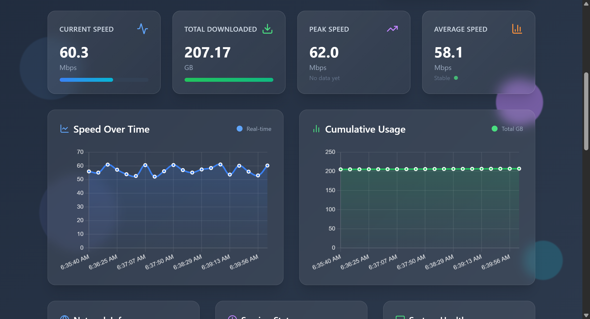
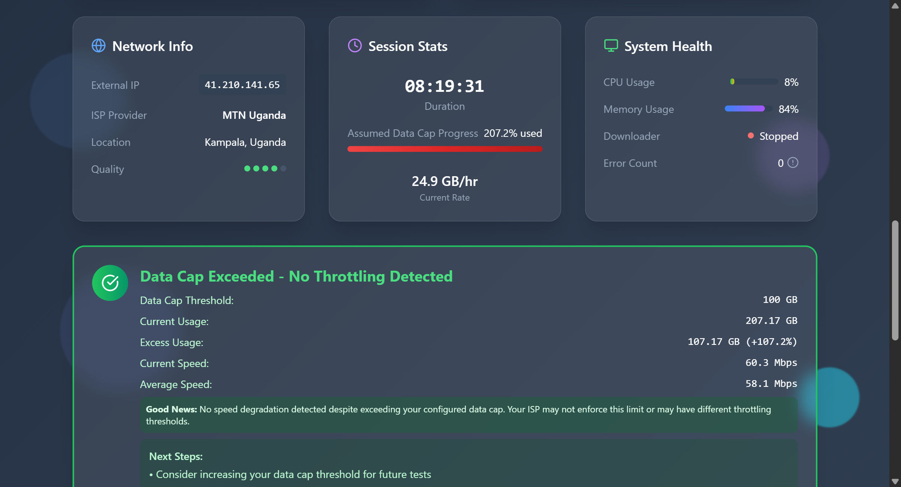
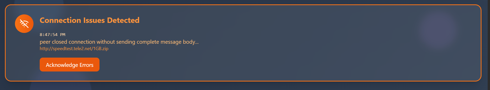

# ISP Data Cap Tester – Verify Your Internet Performance

> Open-source dashboard to measure real-world connection speed, monitor data usage, and flag potential throttling.

ISP Data Cap Tester continuously records downstream throughput and cumulative usage, highlighting slow-downs that may indicate congestion, data-cap enforcement, or other traffic management.

Are you paying for "up to 100 Mbps" but only getting 20 Mbps? Suspicious that your internet slows down after you've used a certain amount of data? This monitoring tool runs 24/7 to catch ISP throttling and data cap shenanigans with beautiful real-time charts and alerts.

[](img/full_page_screenshot.png)
*Click image to see [full dashboard screenshot](img/full_page_screenshot.png)*

### What This Tool Does
✅ Continuously monitors your actual internet speed  
✅ Detects when your ISP throttles your connection  
✅ Tracks data usage and identifies hidden caps  
✅ Runs 24/7 with a beautiful web dashboard  
✅ Alerts you instantly when throttling is detected  


*Real-time network monitoring with ISP details and throttling alerts*

## 🚀 Quick Start (≈2 minutes)

### Step 1: Download and Install
```bash
# Download the project
git clone git@github.com:kanyeceejayA/datacap-tester.git
cd datacap-tester

# Install (works on Windows, Mac, Linux)
pip install -r requirements.txt
```

### Step 2: Start Monitoring
```bash
# Run the dashboard
python server.py
```

### Step 3: Open Your Browser
- Your browser will automatically open to `http://localhost:8000`
- Click the big **"Start Test"** button
- Observe real-time metrics in the dashboard.

That's it! The tool runs in the background and creates beautiful charts showing exactly what your ISP is doing.
The tool now runs in the background and continually updates the dashboard with clear visualisations of your connection.

## 🎯 Key Features

### 🔥 Professional Real-Time Dashboard
- **Beautiful charts** showing speed over time
- **Live statistics** updating every second  
- **Professional design** that looks like enterprise software
- **Mobile responsive** - monitor from your phone

### 📊 Smart Analytics
- **Performance analysis** - shows if you're getting what you pay for
- **Speed consistency tracking** - identifies unreliable connections
- **Usage patterns** - see when your internet is fastest/slowest
- **Historical data** - track ISP behavior over days/weeks

### 🚨 Intelligent Alerts

*Automatic error detection and detailed connection health monitoring*

- **Instant throttling alerts** when your speed drops
- **Connection issue detection** with detailed error reporting
- **Data cap warnings** before you hit limits
- **System health monitoring** to ensure accurate testing

## 🔧 Configuration Made Simple

The tool includes a user-friendly configuration panel where you can:

- **Choose test servers** (Cloudflare, OVH, or your own)
- **Set data cap limits** for your plan
- **Adjust sensitivity** for throttling detection
- **Configure update intervals** 
- **Customize alert thresholds**


## 🛠️ Technical Details (For The Curious)

### Architecture Overview
```
┌─────────────────┐    subprocess    ┌──────────────────┐
│   Web Server    ├─────────────────▶│  Background      │
│  (Dashboard)    │    management    │  Downloader      │
└─────────────────┘                  └──────────────────┘
         │                                    │
         │ reads                              │ writes
         ▼                                    ▼
┌─────────────────────────────────────────────────────────┐
│                Shared Data Store                        │
│   Real-time statistics, charts, logs, config           │
└─────────────────────────────────────────────────────────┘
```

### Technology Stack
- **Backend**: Python with FastAPI (async web framework)
- **Frontend**: Modern HTML5 with TailwindCSS and Chart.js
- **Real-time**: WebSocket connections for live updates
- **Networking**: HTTPX for high-performance HTTP downloads
- **Data**: JSON-based storage (easily readable/exportable)

### File Structure
```
datacap-tester/
├── server.py          # Main web server (584 lines)
├── downloader.py      # Background monitoring engine
├── dashboard.html     # Professional web interface (1,846 lines!)
├── config.json        # User configuration
├── data.json          # Real-time statistics
├── requirements.txt   # Python dependencies
└── README.md          # This awesome guide!
```

## 🌐 API Reference (For Developers)

### REST Endpoints
```bash
# Control the monitoring
POST /api/start          # Start monitoring
POST /api/stop           # Stop monitoring  
POST /api/reset          # Reset all statistics

# Get data
GET  /api/stats          # Current statistics
GET  /api/system         # System information
GET  /api/config         # Current configuration
GET  /api/logs           # Recent log entries

# Configuration  
POST /api/save-config    # Update settings
GET  /api/can-resume     # Check for previous session
```

### WebSocket Real-time Feed
```javascript
// Connect to live data stream
const ws = new WebSocket('ws://localhost:8000/ws');
ws.onmessage = (event) => {
    const data = JSON.parse(event.data);
    console.log(`Speed: ${data.speed_mbps} Mbps`);
    console.log(`Total: ${data.total_gb} GB`);
};
```

### Sample API Response
```json
{
  "status": "running",
  "speed_mbps": 87.3,
  "total_gb": 15.2,
  "session_duration": 3600,
  "avg_speed": 89.1,
  "peak_speed": 145.8,
  "throttle_detected": false,
  "cap_percentage": 30.4,
  "isp": "MTN UG",
  "external_ip": "203.0.113.42",
  "last_update": "2024-01-15T14:30:00Z"
}
```

## ⚙️ Advanced Configuration

### Multiple Test Servers
```json
{
  "test_urls": [
    "https://speed.cloudflare.com/__down?bytes=100000000",
    "https://proof.ovh.net/files/1Gb.dat", 
    "http://speedtest.tele2.net/1GB.zip"
  ]
}
```

### Throttling Detection Settings
```json
{
  "throttle_threshold_percent": 30,
  "baseline_samples": 50,
  "detection_window": 100
}
```

### Data Cap Monitoring
```json
{
  "data_cap_gb": 1000,
  "cap_warning_percent": 80,
  "post_cap_monitoring": true
}
```

## 🧪 Testing & Development

### Run the Test Suite
```bash
python test_backend.py
```

### Manual Testing
```bash
# Test individual components
python -c "import server; print('✅ Server OK')"
python -c "import downloader; print('✅ Downloader OK')"

# Test API endpoints
curl http://localhost:8000/api/stats
curl -X POST http://localhost:8000/api/start
```

### Performance Specifications
- **CPU Usage**: 5-15% during active monitoring
- **Memory**: 50-100MB total
- **Network**: Configurable chunk sizes (10-100MB)
- **Storage**: Minimal (only small JSON files)
- **Scale**: Tested from 1 Mbps to 1000+ Mbps connections

## 🔒 Privacy & Security

- **🏠 100% Local**: All data stays on your computer
- **🚫 No Tracking**: Zero analytics or external reporting  
- **🔓 Open Source**: Full code transparency
- **🛡️ Secure**: No data stored on disk, only statistics
- **🔐 Private**: Your ISP can't tell you're monitoring them

## 🚀 Deployment Options

### Home/Personal Use
```bash
# Simple - just run it
python server.py
```

### Always-On Monitoring (Linux)
```bash
# Create systemd service for 24/7 monitoring
sudo systemctl enable datacap-tester
sudo systemctl start datacap-tester
```


## 🤝 Contributing & Support

### Found a Bug? 
- 🐛 [Report issues](https://github.com/kanyeceejayA/datacap-tester/issues)
- 💡 [Request features](https://github.com/kanyeceejayA/datacap-tester/discussions)
- 🔧 [Submit pull requests](https://github.com/kanyeceejayA/datacap-tester/pulls)

### Next Steps
A JS version of this tool to be run in browser. anyone should be able to click a button and start monitoring.


---

## 🎉 Ready to Catch Your ISP?

**[Download Now](https://github.com/kanyeceejayA/datacap-tester/archive/main.zip)** and start monitoring in 2 minutes!

*Built because MTN UG refused to answet my x post about having data caps*
